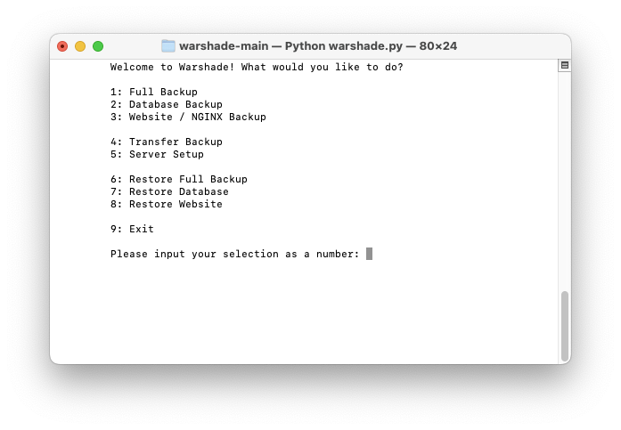

Warshade is a program I created to help automate server backup, transfer, and restoration.

The purpose of this is to achieve rapid response times for whenever my friend and I were constantly upgrading servers. This helped us out enourmously, and cut down installation times by a tremendous amount.

This is the Python3 variant of my Peacebringer program that's written in Bash natively. Warshade is my attempt at learning some Python3 programming, all while expanding upon the features of Bash where I can. This is basically a Python3 program that just executes Bash commands.

If this is somehow hard to comprehend right away, please refer to Peacebringer to get a better grasp of what we're trying to accomplish here, and then return to Warshade to see how it was implemented.

